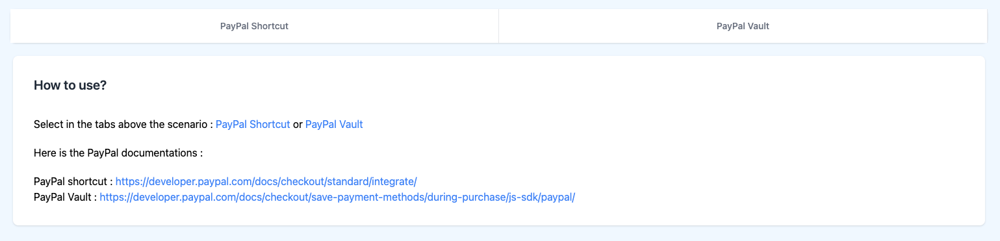
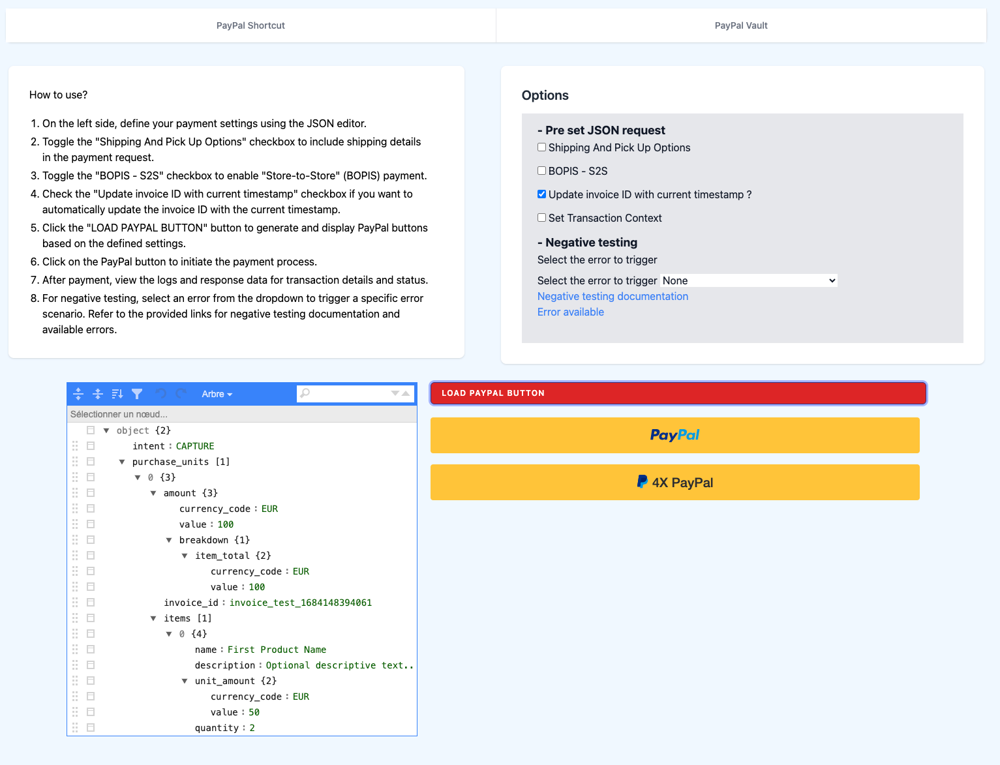
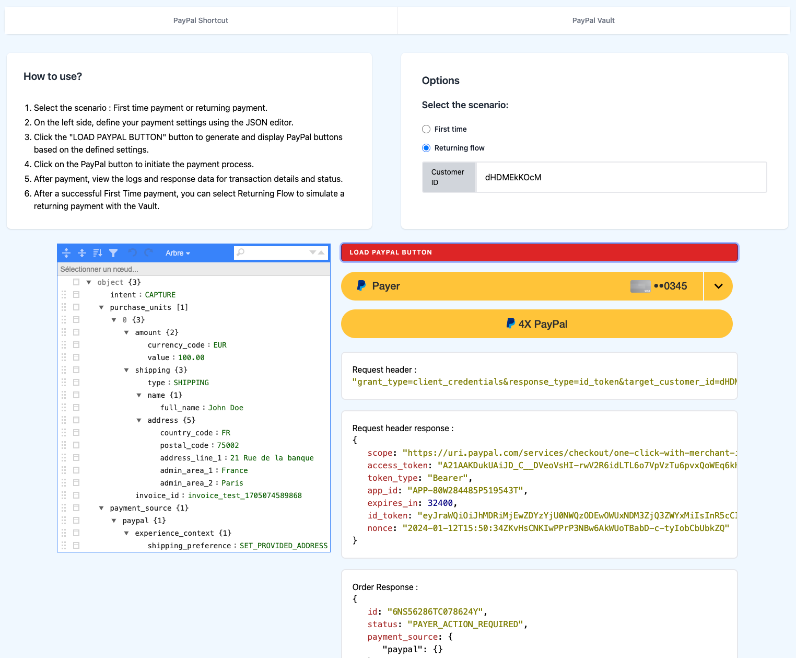

# PayPal NodeJS Integration

PayPal Tutorial: [https://developer.paypal.com/docs/checkout/standard/integrate/](https://developer.paypal.com/docs/checkout/standard/integrate/)

## Installation

1. Clone the repository: `git clone https://github.com/lucaskameleoon/PayPal_nodeJS_tuto.git`
2. Install dependencies: `npm install`

## Configuration

Duplicate `.env.exemple` to a `.env` file at the root of the project and add the necessary environment variables.

## How to Run

To start the project, run the following command:

```bash
npm start
```

## How to Use

Go to /shorcut or /vault to test PayPal shortcut or PayPal vault

## Screenshots

- Index


<br />

- PayPal Shortcut


<br />

- PayPal Vault

